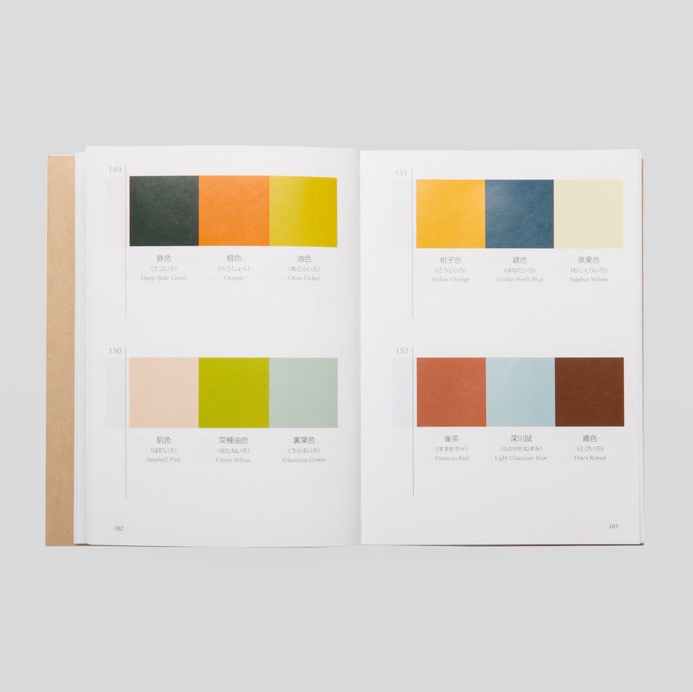

# dictionary-of-colour-combinations

A JSON dataset of 348 colour combinations (of 2, 3, and 4 colours) of 159 unique colours, from the book ["A Dictionary of Colour Combinations"](https://coloursmayvary.com/products/copy-of-a-dictionary-of-colour-combinations-by-sanzo-wada) compiled by Sanzo Wada (1883 – 1967) and published by Seigensha Art.



### Special Thanks

The data here has originally been compiled and open sourced by **Dain M. Blodorn Kim** (@dblodorn) for his interactive web version ([dblodorn/sanzo-wada](https://github.com/dblodorn/sanzo-wada/)). In this fork, I've fixed some incorrect data from the original, used a more perceptual CMYK to RGB conversion, and encapsulated the dataset as a standalone and distributed project.

### Data

See [./colors.json](./colors.json), an array of colours where each takes the following form:

```js
{
  "name": "Burnt Sienna",
  "combinations": [ 198, 242, 263, 285, 286, 297, 312, 333, 343 ],
  "swatch": 0,
  "cmyk": [ 22, 76, 100, 15 ],
  "lab": [ 46.43778133821622, 36.23346303501947, 43.7898832684825 ],
  "rgb": [ 174, 82, 36 ],
  "hex": "#ae5224"
}
```

In the book, each unique colour has:

- A name such as "Burnt Sienna" or "Rosolanc Purple"
- Combinations: which palette(s) this colour is associated with (identifiers from 1 to 348)
- CMYK values in `C% / M% / Y% / K%` from 0 to 100
- Which swatch book the colour is associated with (the 159 colours are split into 6 chapters)

The colours are already sorted by the author in a fairly pleasing way, and the data here maintains that order.

## Installation

If you are using JavaScript and npm/Node.js, you can install it like so:

```sh
npm install dictionary-of-colour-combinations
```

## Example – Extracting Palettes

This is left up to the user, but for example if you wish to get a list of palettes from the book, you could use this (JavaScript):

```js
const colors = require('dictionary-of-colour-combinations');

const map = colors.reduce((map, color, i) => {
  color.combinations.forEach(id => {
    if (map.has(id)) map.get(id).push(i);
    else map.set(id, [ i ]);
  });
  return map;
}, new Map());

const palettes = [ ...map.entries() ]
  .sort((a, b) => a[0] - b[0])
  .map(e => e[1]);

console.log(palettes.length); // 348
```

## CMYK to RGB

The original data by @dblodorn contained some conversions from CMYK to RGB that looked very different than the physical colours in the book.

In this fork of the data, each CMYK value is converted to RGB using specific colour profiles that attempt to better represent the physical printed colours:

- CMYK: U.S. Web Coated (SWOP) v2.icc
- RGB: sRGB IEC61966-2.1.icc

(Converted with Relative Colorimetric and Black Point Compensation)

These conversions provides the `rgb`, `lab` (L\*a\*b\* with D50 illuminant) and `hex` fields in the JSON data.

There may still be some differences to the book's printed swatches, as the conversion is not exact.

## Converting from Source

If you wish to convert the CMYK values to RGB/LAB/HEX with a different profiles, you can do the following with Python:

```sh
pip3 install -r requirements.txt
```

Then, change the profile files in `augment_sanzo.py` and run the script:

```sh
python3 src/augment_sanzo.py
```

## License

MIT, see [LICENSE.md](http://github.com/mattdesl/dictionary-of-colour-combinations/blob/master/LICENSE.md) for details.